# Programming Abstractions in C++  (CS106B)

Welcome.  This repository captures my exploration of course work offered through the Stanford Center for Professional Development.

The resources I studied included:

   * Text: "Programming Abstractions" by Eric Roberts (adapted for C++ by Julie Zelenski and others) August 2012
     http://web.stanford.edu/class/archive/cs/cs106b/cs106b.1136/materials/CS106BX-Reader.pdf

   * Video: Julie Zelenski's CS106B lectures on iTunes University 2008

   * Assignments: from Keith Schwarz's Spring 2013 section.
     http://web.stanford.edu/class/archive/cs/cs106b/cs106b.1136

## The journey of 1000 pages ...

The text covers a vast amount of material but the writing is quite good and the chapter exercises interesting.  The motivated student will find a rich toolbox of problem solving strategies with emphasis on:

   * Abstract Data Types (vectors, stacks, queues, maps, sets, graphs)

   * Recursion

along with exposure to class design, searching, sorting, algorithmic efficiency, ADT internals and implementation.

Packaging this content to fit the time constraints of a college-level, undergraduate course obviously imposes limits on scope.  Consequently, you'll only see limited discussion of object orientation (inheritance, polymorphism), exception handling, and the Standard Template Library (iterators, functors).  Thread safety is also left for another day.

However, this material does position you to solve interesting problems, to think about scale and efficiency, and to fearlessly embrace recursion.  The C++ system header files will still seem a bit menacing though more decipherable and you can start parsing Scott Meyer's Effective C++ series without getting glassy eyed after 10 minutes.

## Disclaimer

Solutions for about 80% of the problems from the text are included in the repository.  I'm self-assessing this to be beginner-level to intermediate-level C++.  I'm not always const-correct, I don't adhere to a strict test driven development scheme, and the code would benefit from some review.  (I'm sure there is a bug or two lurking in the almost 200K+ lines of code. :-) The STL is only leveraged in the final chapter, but this is more a consequence of Stanford's decision to initially shield students from some language and library rigors that might stymie the uptake of general concepts around programming abstractions.  Stanford offers their own gentle onramp to collection classes and convenience utilities through the libStanfordCPPLib.a library which I leverage in my solutions.

## Assignments (Demo Day!)

The course included 7 assignments.

[[overview]](assignments/README.md) [[code]](assignments/2013_spring)


## Chapter Highlights

The following provides chapter highlights.  I've also pointed out a few problems that were especially fun or interesting.

### Chapter 1 Overview of C++

[[code]](01-overview)

General motivation and background for C++ itself.  Language overview, built-in types, control flow, structure of programs, using libraries.

### Chapter 2 Functions and Libraries

[[code]](02-functions-and-libs)

Using functions.  <cmath> library.  Separation of client from underlying implementation through an interface.
Principles of interface design: 1. Unified 2. Simple 3. Sufficient 4. General 5. Stable
Design of a random number generator (normalization, scaling, translation, coversion).  Stanford libraries (gwindow.h).


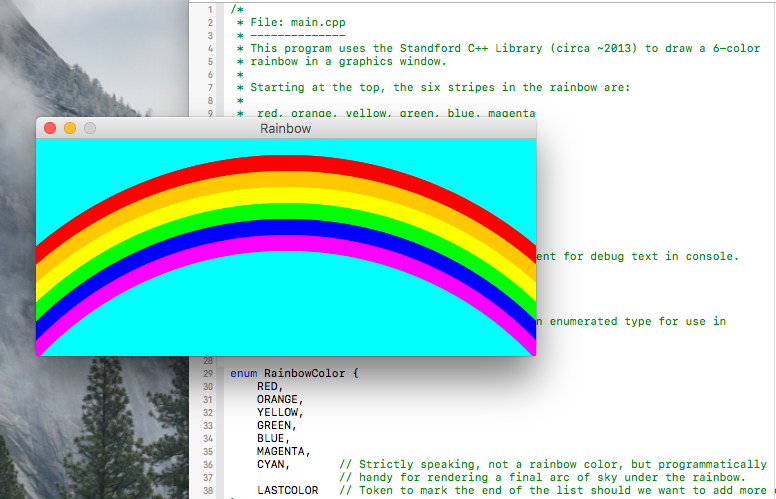

[Yin-Yang](02-functions-and-libs/readerEx.02.18/main.cpp)

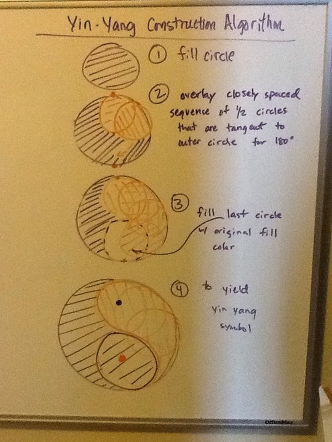
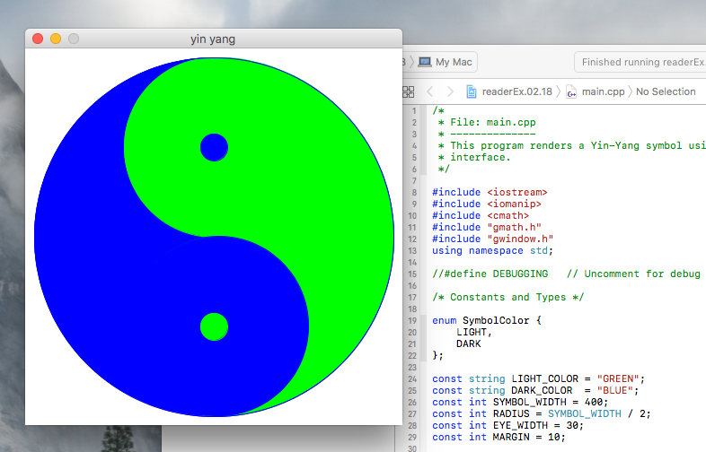

### Chapter 3 Strings

[[code]](03-strings)

Strings as abstract data type.  Intro to <string> library.  str.substr(pos, n), etc.
Strings are mutable in C++!
Character-level functions via <cctype> library.  isalpha(ch), toupper(ch), etc.
Two-flavors running around: C-style and C++ style.
You may need to cast string literals to get the C++ flavor:
```
string str = string("hello,") + "world";
```
Stanford "strlib.h" library

[Obenglobish](03-strings/readerEx.03.16/main.cpp)

[DNA Snippet Attachment](03-strings/readerEx.03.20/main.cpp)

### Chapter 4 Streams

[[code]](04-streams)

Using <iostream> and <iomanip> to produce formatted output. setw(int), setprecision(digits).
File streams <fstream> for ifstream and ofstream. 
```
stream.open(fname), stream.fail(), stream.clear(), stream.eof(), stream.get(), stream.put(ch), getline(stream, str).
while ((ch = infile.get()) != EOF)
```
Stanford "simpio.h" and "filelib.h" libraries.

### Chapter 5 Collections

[[code]](05-collections)

Intro to vectors, grids, stacks, queues, maps, sets.
Waiting line simulation using queues.
Bootstrap a set. 
```
const Set<char> DIGIT_SET = setFromString("012345");
```
Lexicon!

[Checkout line simulation](05-collections/readerEx.05.16/main.cpp)

[Disney and 'Our Friend the Atom' Fission Simulation with grid ADT](05-collections/readerEx.05.18/main.cpp)

[Morse-code translator](05-collections/readerEx.05.19/main.cpp)

[Area-code lookups](05-collections/readerEx.05.20/main.cpp)

### Chapter 6 Designing Classes

[[code]](06-class-design)

Point class. Operator overloading.  Insertion operator.  Equality operator.
Member function versus free function
```
bool Point::operator==(Point rhs) versus friend bool operator==(Point p1, Point p2);
```
Case study: rational numbers.
1. Think generally about how clients are likely to use the class.
2. Determine what info belongs in the private state of each object.
3. Define a set of constructors to create new objects.
4. Enumerate the operations that will become public methods of the class.
5. Code and test the implementation.
Case study: token scanner class.
Encapsulating programs as classes.


### Chapter 7 Intro to Recursion

[[code]](07-recursion-intro)

```
if (test for simple case) {
   Compute simple solution without using recursion
} else {
   Break prob into subprob of same form.
   Solve each subprob with recursive call
   Reassemble sub-solutions into whole solution
}
```
factorial
Fibonacci tn = tn-1 + tn-2
recurrence relation: each element in seq defined in terms of earlier elements
efficiency considerations
palindromes
binary search
common pitfals / checklist:
Did you start by checking for simple case?
Did you solve simple case correctly?
Does recursive decomp make prob simpler?
Does simplification process converge to simple case?
Are recursive calls truly identical in form to original call?
Did you reassemble parts to make whole?

[Pascal's Triangle to solve c(n, k).](07-recursion-intro/readerEx.07.09/main.cpp)

### Chapter 8 Recursive Strategies

[[code]](08-recursion-strategies)

Towers of Hanoi. subset-sum, inclusion/exclusion, permutations.
Graphical recursion: mondrian, fractals.

Mondrian


Fractal Coast


Koch Triangles
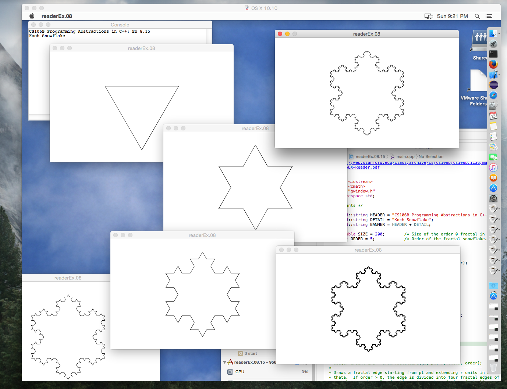

H-Fractal


Wallinger Tree
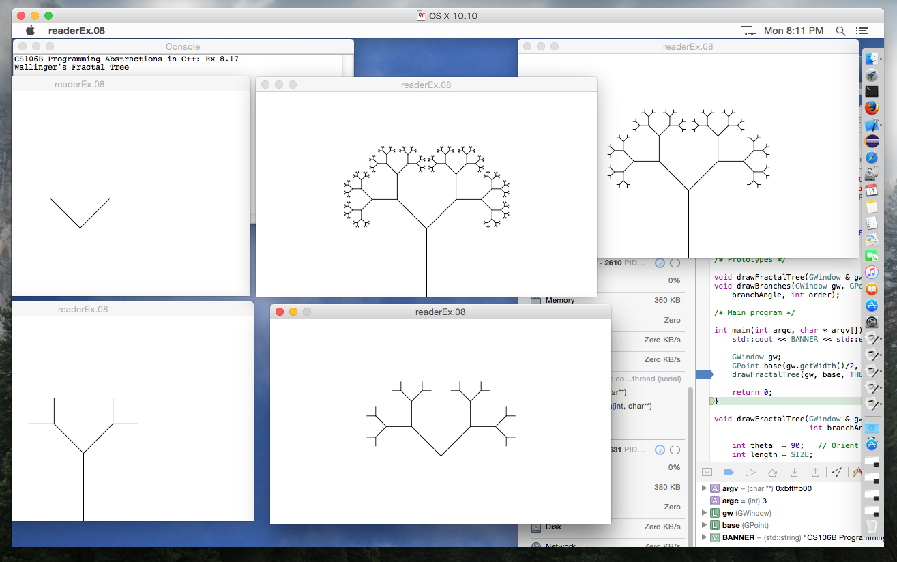

Sierpinksi Triangle
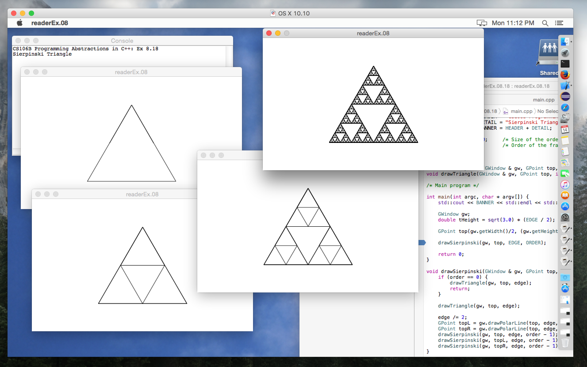

### Chapter 9 Backtracking Algorithms

[[code]](09-recursion-backtracking)

```
if you are already at a solution, report success.
for (every possilbe choice in current config) {
	make choice and take step along that direction
	use recursion to solve prob from new position
	if recursion succeeds, report success to higher level
	back out of current position to restore state at beginning of loop
}
report failure
```
Generalized two-player game with minimax algorithm.
Limiting recursive depth.

[Leaving the maze ... with and without breadcrumbs](09-recursion-backtracking/readerEx.09.02/main.cpp)
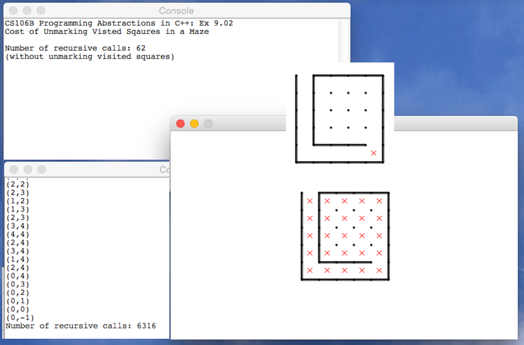

[Instant Insanity](09-recursion-backtracking/readerEx.09.07/main.cpp)

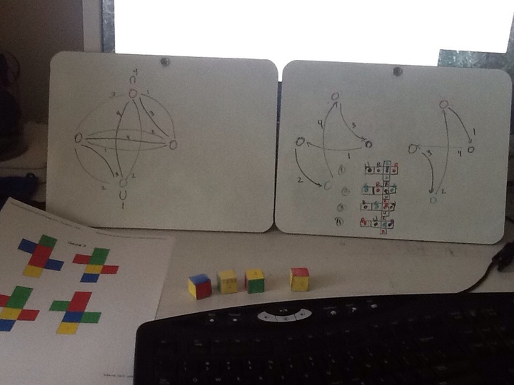

[Domino Chain](09-recursion-backtracking/readerEx.09.09/main.cpp)

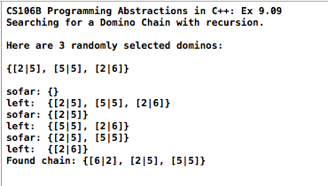

[Nim Game](09-recursion-backtracking/readerEx.09.13/Nim.cpp)

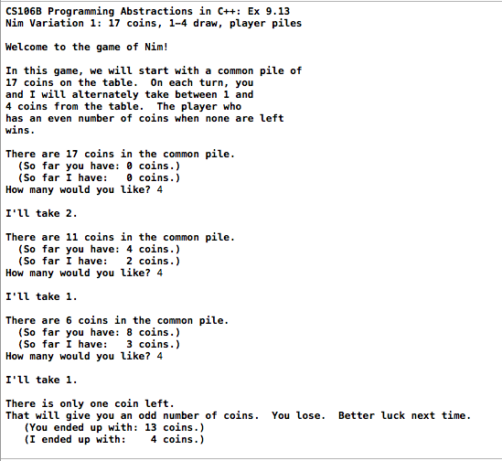

[Boggle](09-recursion-backtracking/readerEx.09.16/Boggle.cpp)

### Chapter 10 Algorithmic Analysis

[[code]](10-algorithmic-analysis)

selection sort, computational complexity, Big-O notation
```
t(N) = O(f(N))
t(N) <= C x f(N) for large enough N and positive constant C.
```
divide and conquer
merge sort
complexity classes: constant, logarithmic, linear, linearithmic, quadratic, cubic, exponential
quick sort
mathematical induction: start with base and generalize
recursion: start with general and reduce to base case.

[Insertion Sort](10-algorithmic-analysis/readerEx.10.02/main.cpp)

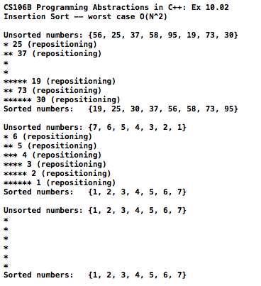

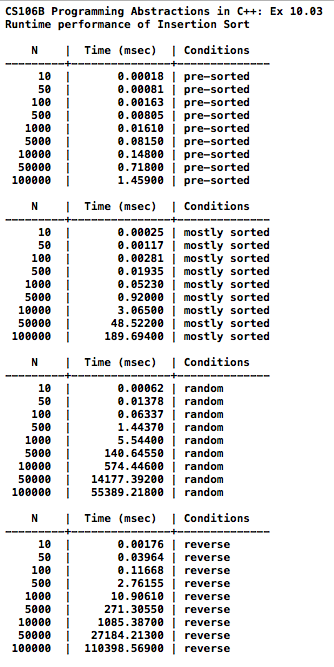


[O(N) Sort for range-bounded array of integers](10-algorithmic-analysis/readerEx.10.04/main.cpp)

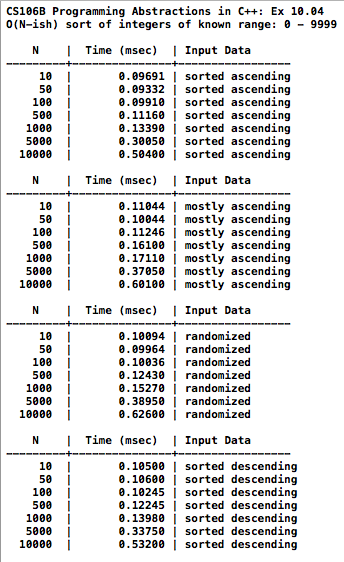


[Linear vs Binary search](10-algorithmic-analysis/readerEx.10.05/main.cpp)

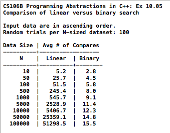


[QuickSort w/median pivot](10-algorithmic-analysis/readerEx.10.06/main.cpp)

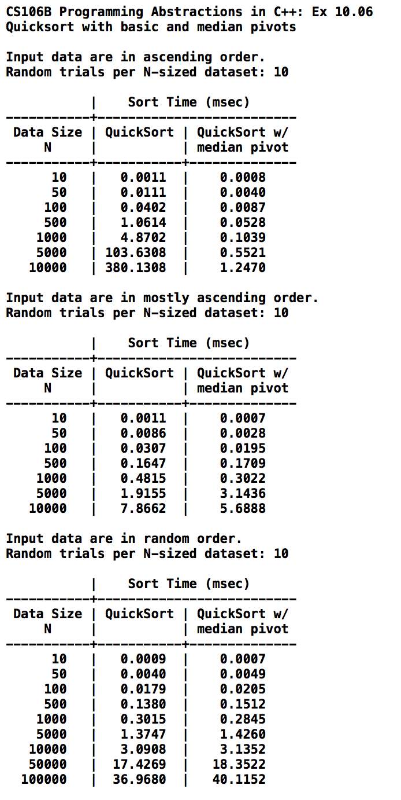


[Hybrid QuickSort/Insertion Sort](10-algorithmic-analysis/readerEx.10.08/main.cpp)

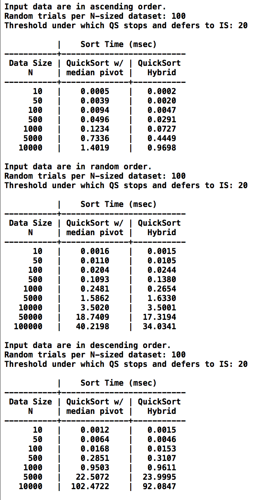

[Recursive O(logN) Fibonacci](10-algorithmic-analysis/readerEx.10.12/main.cpp)

### Chapter 11 Pointers and Arrays

[[code]](11-pointers-and-arrays)

### Chapter 12 Heap Management

[[code]](12-heap-management)

### Chapter 13 Text Editor

[[code]](13-text-editor)

### Chapter 14 Linear Structures

[[code]](14-linear-structures)

### Chapter 19 Inheritance

[[code]](19-inheritance)

[Hit Detection](19-inheritance/readerEx.19.03/main.cpp)

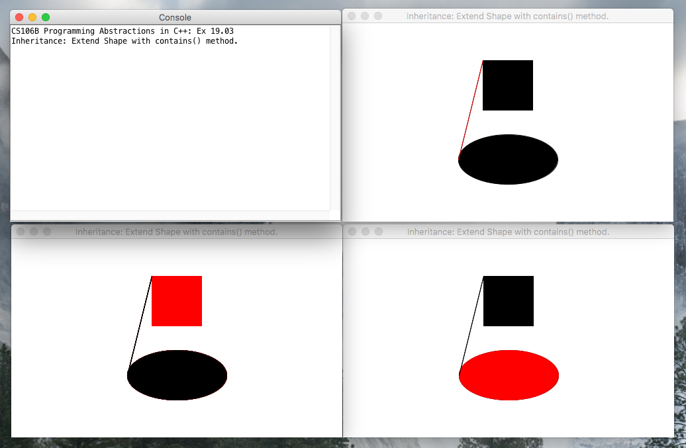

[Recursive descent parser](19-inheritance/readerEx.19.07/main.cpp)

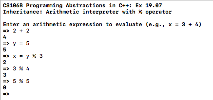

### Chapter 20 Iterators

[[code]](20-iterators)

[Growth curves](20-iterators/readerEx.20.02/main.cpp)

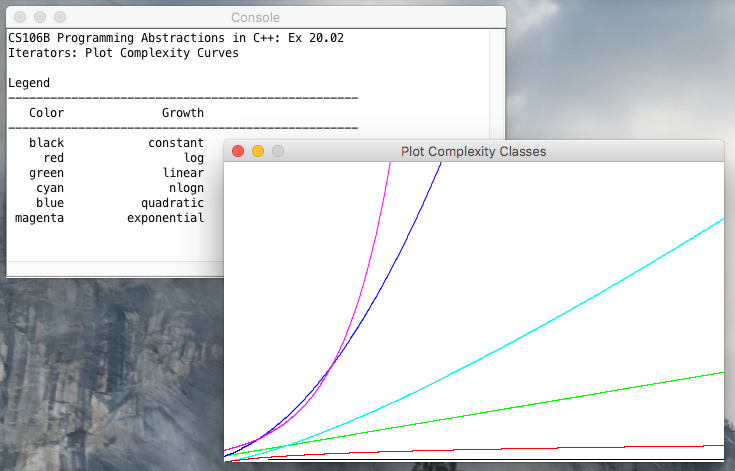

[Parse and plot](20-iterators/readerEx.20.06/main.cpp)

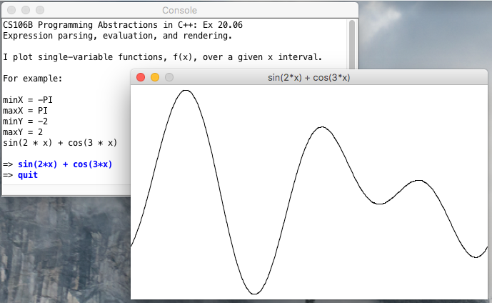

[Numerical integration](20-iterators/readerEx.20.07/main.cpp)

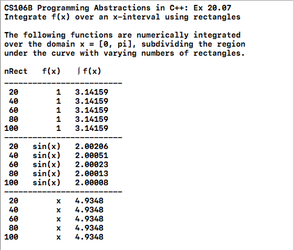

[max_element](20-iterators/readerEx.20.08/main.cpp)


