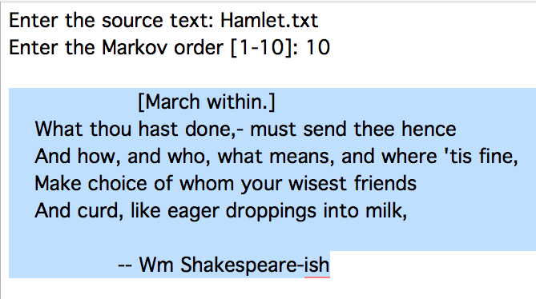
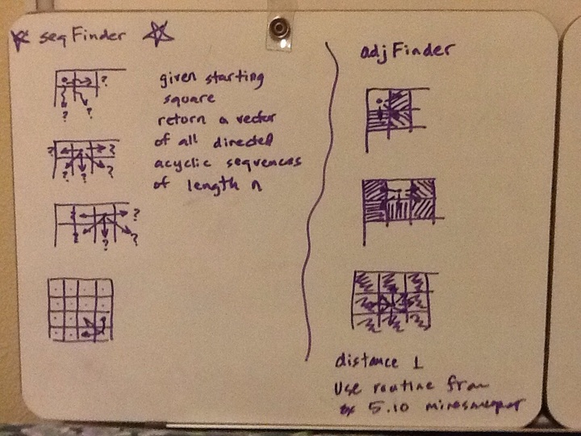
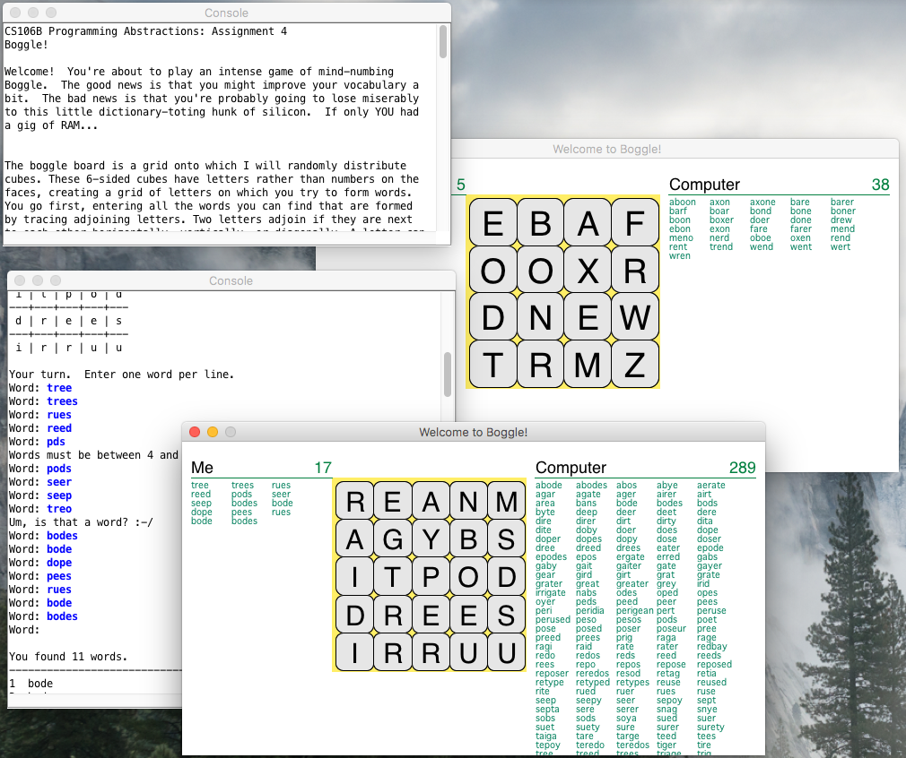
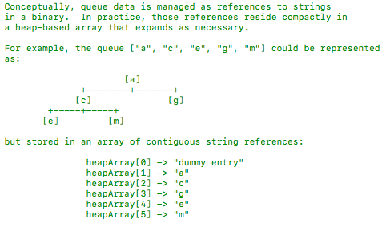
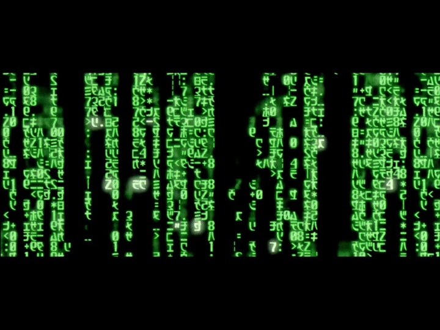
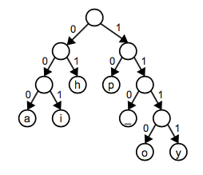
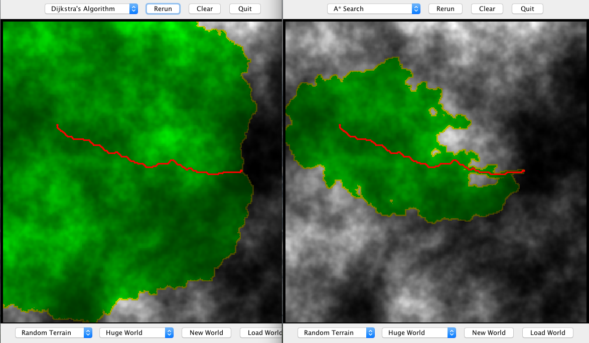
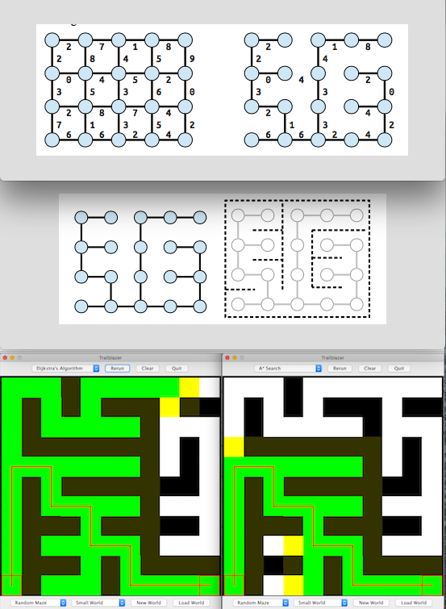
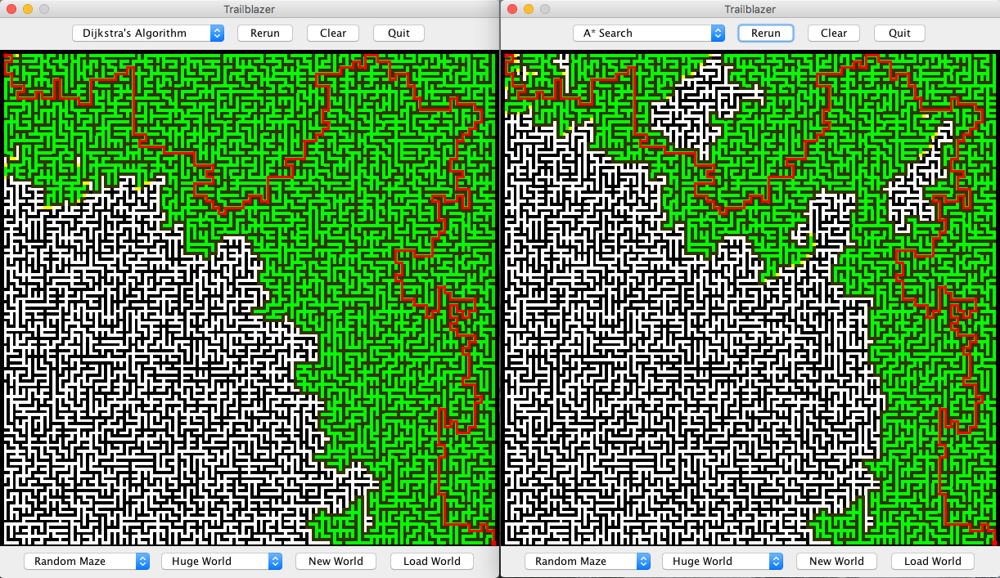

# CS106B Programming Assignments

## 1 Welcome

Prove we can setup a dev environment and then leverage functions to write some simple programs, culminating in an interesting implementation of the Flesch-Kincaide grade-level readability metric that follows this formula:

   Grade = C0 + C1(num words / num sentences) + C2(num syllables / num words)

Computing syllables is tricky, but some heuristics come to the rescue.

## 2 Collections

Play with vectors, queues, maps, and lexicons to build a word-ladder and a Markov random-writer.

## 3 Recursion

Several opportunities to apply recursive problem solving.  One involves graphical recursion:

## 4 Boggle

Use recursion with backtracking -and- the lexicon to create a virtually unbeatable Boggle opponent:

## 5 Priority Queues

Variations on a theme in implementing some priority queues.  These have wide application and they'll surface in the last two assignments.  One of the flavors we implement is based upon a binary heap:

## 6 Huffman Encoding

Implement a program to compress / decompress any kind of file using Huffman's variable-length, prefix-unique algorithm which ascribes the shortest bit encodings to the most frequently occurring symbols and longer encodings to less frequent symbols.  At the heart of the algorithm are encoding trees that look like this:

## 7 Graph Algorithms

Finally, wrap up with a really cool least-cost route finding assignment.  We implement Dijkstra's algorithm and an optimized variant called A* Search which applies a heuristic function to guide the exploration of potential paths from A to B:

Then we apply these two algorithms to finding our way through a maze, after using Kruskal's minimum spanning tree algorithm to build a random maze in the first place.

